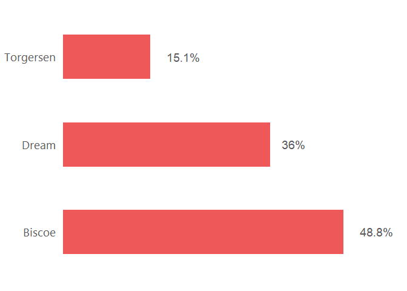
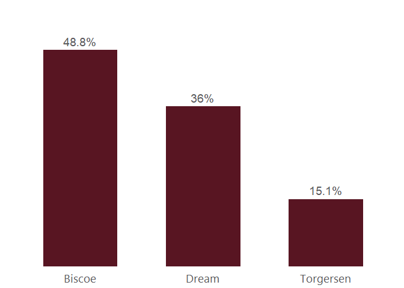
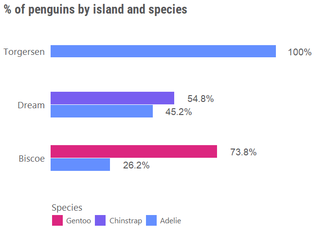

<!-- README.md is generated from README.Rmd. Please edit that file -->

# impactR.viz

<!-- badges: start -->
<!-- badges: end -->

`impactR.viz` proposesready-to-go colors and color palettes for IMPACT,
and a few functions for plats and maps.

## Installation

You can install the development version of impactR.viz from
[GitHub](https://github.com/) like so:

``` r
devtools::install_github("gnoblet/impactR.viz")
```

## Request

Please, do not hesitate to pull request any new viz, colors or color
palettes, or to email request any change (<gnoblet@zaclys.net>).

## Colors

Branding color palettes for REACH, AGORA and IMPACT are available.
Functions to access colors and palettes are `color()` or `palette()`.

``` r
library(impactR.viz)
#> 
#> Attaching package: 'impactR.viz'
#> The following object is masked from 'package:grDevices':
#> 
#>     palette

# Get all saved REACH colors, named
color(unname = FALSE)[1:10]
#>                      white                 light_grey 
#>                  "#FFFFFF"                  "#E3E3E3" 
#>                  dark_grey                      black 
#>                  "#464647"                  "#000000" 
#>        branding_reach_grey         branding_reach_red 
#>                  "#58585A"                  "#EE5859" 
#>  branding_reach_light_grey       branding_reach_beige 
#>                  "#C7C8CA"                  "#D2CBB8" 
#>    branding_agora_bordeaux branding_agora_light_beige 
#>                  "#581522"                  "#DDD8C4"

# Extract a color palette as hexadecimal codes and reversed
palette(palette = "cat_5_ibm")
#> [1] "#648fff" "#785ef0" "#dc267f" "#fe6100" "#ffb000"

# Get all color palettes names
palette(show_palettes = T)
#>  [1] "branding_reach"          "branding_impact"        
#>  [3] "branding_agora"          "cat_2"                  
#>  [5] "cat_2_light"             "cat_2_green"            
#>  [7] "cat_2_blue"              "cat_5_ibm"              
#>  [9] "cat_3"                   "cat_3_tol_high_contrast"
#> [11] "cat_8_tol_adapted"       "cat_8_wong"             
#> [13] "quant_2_red"             "quant_3_red"            
#> [15] "quant_4_red"             "quant_5_red"            
#> [17] "quant_6_red"             "quant_7_red"            
#> [19] "quant_2_yellow"          "quant_3_yellow"         
#> [21] "quant_4_yellow"          "quant_5_yellow"         
#> [23] "quant_6_yellow"          "quant_7_yellow"         
#> [25] "quant_2_green"           "quant_3_green"          
#> [27] "quant_4_green"           "quant_5_green"          
#> [29] "quant_6_green"           "quant_7_green"          
#> [31] "quant_2_artichoke"       "quant_3_artichoke"      
#> [33] "quant_4_artichoke"       "quant_5_artichoke"      
#> [35] "quant_6_artichoke"       "quant_7_artichoke"      
#> [37] "quant_2_blue"            "quant_3_blue"           
#> [39] "quant_4_blue"            "quant_5_blue"           
#> [41] "quant_6_blue"            "quant_7_blue"
```

## Charts

### Example 1: Bar chart

``` r
library(impactR.viz)
library(palmerpenguins)
library(dplyr)
#> 
#> Attaching package: 'dplyr'
#> The following objects are masked from 'package:stats':
#> 
#>     filter, lag
#> The following objects are masked from 'package:base':
#> 
#>     intersect, setdiff, setequal, union
# install.packages("gghighlight")
# library(gghighlight)

df <- penguins |> 
  count(island) |> 
  mutate(freq = prop.table(n)*100) |> 
  arrange(freq)

# Simple bar chart
bar(df, "island", "freq", width = 0.5) 
```



``` r

# Vertical one, need some theme tweaking
bar(df, "island", "freq", width = 0.6, add_color = color("branding_agora_bordeaux"), flip = F, theme = theme_reach(axis_y = F, grid_major_x = F, axis_ticks_x = F)) 
```



``` r

df <- penguins |> 
  count(island, species, name = "count") |> 
  mutate(freq = count/sum(count)*100, .by = "island") 

# Simple bar chart by group with some alpha transparency
bar(df, "island", "freq", "species", title = "% of penguins by island and species", group_title = "Species") 
```



``` r

# Cchange of palette, change of theming to adapt
bar(df, "island", "freq", "species", group_title = "Species",  alpha = 0.6, flip = FALSE, title = "% of penguins by island and species", palette = "cat_3_tol_high_contrast", theme = theme_reach(axis_y = F, grid_major_x = F, axis_ticks_x = F))
```


### Example 2: Point chart

At this stage, \[point()\] only supports categorical grouping colors
with the `group` arg.

``` r

# Simple point chart
point(penguins, "bill_length_mm", "flipper_length_mm", title = "What a good test title!")
#> Warning: Removed 2 rows containing missing values (`geom_point()`).
```


``` r

# Point chart with grouping colors, different palette, greater dot size, some transparency, reversed color palette
point(penguins, "bill_length_mm", "flipper_length_mm", "island", palette= "cat_8_wong", group_title = "Islands", alpha = 0.7, size = 3)
#> Warning: Removed 2 rows containing missing values (`geom_point()`).
```


